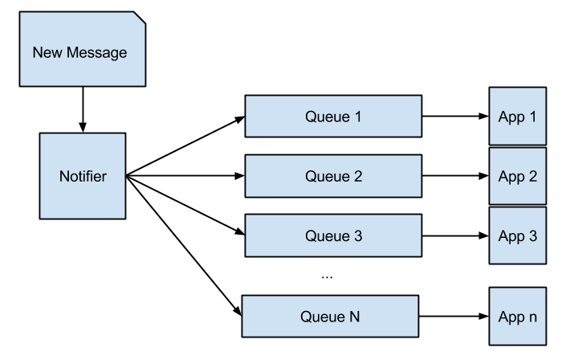
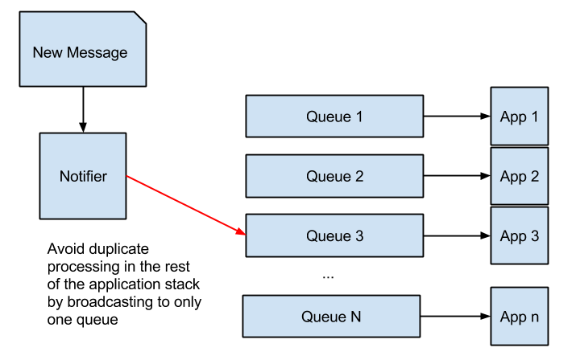
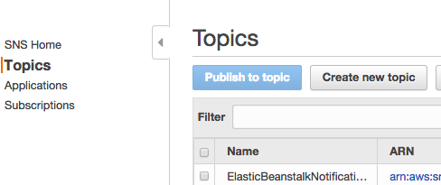
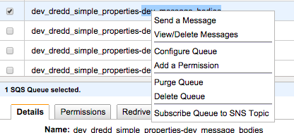

# Dredd The Judger Of Tasks
Dredd is vespers eyes and ears, it is always watching, always judging.

## Requirements
- Built on Python 2.7.3
- Pip
- Redis
- Mongo Database w/ Enron Email Corpus Loaded (http://mongodb-enron-email.s3-website-us-east-1.amazonaws.com/) --if you are building a classifier

## Environment Variables
- `MEM_STORE_HOST` = Obvious
- `MEM_STORE_PORT` = Obvious
- `MEM_STORE_DB` = Obvious
- `MEM_STORE_TYPE` = Obvious
- `POLL_INTERVAL` = Interval To Poll The Server
- `AWS_ACCESS_KEY_ID` = Obvious
- `AWS_SECRET_ACCESS_KEY` = Obvious
- `AWS_Q_REGION` = The region that the queue is in
- `AWS_S3_BUCKET_NAME` = Name of bucket to search for unprocessed entities (needed for primer but the config class currently requires that this variable is set)
- `PUB_SUB_PREFIX` = topic and app prefix for pubsub (usually `dev` in development)
- `PUB_SUB_TOPIC` = pubsub topic (historically `message_bodies`)

## Setup
```
$ pip install -r ./requirements.txt
$ python setup
```

# Testing
Go into the dredd folder (yes, inside the dredd project is a folder called `dredd`, go into that folder)
```
$ cd dredd
$ nosetests
```

# Running
To launch processing, substitute `PROCESSING_TYPE` in the command line with a processing type
```
$ python dredd PROCESSING_TYPE start
```
Processing Types Available
- `questions`
- `simple_properties`


To initialize Dredd from no data (Dredd can also resume a failed initialization)
```
$ python dredd prime start
```

## Priming
In some cases you'll need to initialize a part of or the entire network.

Dredd uses a pub/sub model. Each individual Dredd process receives a message at least once and processes that message.

In this example, a new message goes into a notifier and is broadcast to individual queues. In this way each application receives a message at least once.


If `App1` is responsible for judging whether there are questions in the latest email in the thread and `App3` judges the urgency of language in the thread and you've tweaked `App3` to be better at it's job, you'll need to re-initialze `App3` using priming.

If you attempt to prime `App3` without making special modifications to the data flow you will re-broadcast every single item to Apps 1-n, forcing all of those apps to re-iniaizlie. **Don't do that.**

Instead, change the flow of data for the priming process such that old data flows only to `Queue 3`.


That's better.

### Changing Pub/Sub in AWS
Today we use AWS to handle PubSub activities. Here's how to broadcast to selected queues using AWS.

**Make sure you have provisioned the correct queues in SQS using instructions at [ORP-API](https://github.com/octaviuslabs/orp-api)**

1. In the SNS console click "Create new topic"


2. Give the topic a name (Prefix the name with `dev` or the appropriate environment for the work you're doing. This makes it easier for other developers and the app to know which data pipeline to use.) - for example `dev_djurek_work` **Remember: NO DASHES IN THE NAME**

3. In the SQS console, right click on the queue you wish to subscribe to notifications and select `Subscribe Queue to SNS Topic`


4. Select the topic from the dropdown list and click `Subscribe`.

5. Repeat steps 3 and 4 for every queue that receives messages

6. Adjust the `PUB_SUB_TOPIC` configuration value to equal the SNS topic name you made (minus the prefix specified in `PUB_SUB_PREFIX`, e.g. `dev_djurek_work` is just `djurek_work` without the `dev_`)

7. Run dredd prime

8. Revert the `PUB_SUB_TOPIC` back to the topic to which you're really subscribing. (e.g. `message_bodies`)

## Building A Question Classifier
The script used to train the classifier is in the root directory under “train_classifier”. This file will write to  “classified_output” a classifier, scored sample emails and the questions that were classified.

To re-train, the user just needs to change the input text in the "train_classifier.py" file and re-rerun the script.

The feature extractor for sentances is located in the "Sentance" class, which every email used to break apart its sentances.

## Storing scores
Dredd can store scores and all required information to REDIS so that it can be easily accessed by other services. To do this, you will want to:

1. Save load up an email, with the EmailMessage class, the class assumes
```
# Assumed EmailMessage Attributes
attrs = {
    "id": "this-be-my-id",
    "account_id": "this-is-the-accoundid",
    "thread_id": "a-thread-of-email",
    "sent_at": "2015-02-23T21:22:48.000Z",
    "url": "http://lts.meetvesper.com/id",
    "from_id": "id-for-from-contact",
    "to_ids": [
        "id-to-1",
        "id-to-2",
        "id-to-3"
    ],
    "cc_ids": [
        "id-to-1",
        "id-to-2",
        "id-to-3"
    ],
    "bcc_ids": [
        "id-to-1",
        "id-to-2",
        "id-to-3"
    ],
    "subject": "This Is The Subject Of The Email",
    "body": "This is the body of the email"
}
email = EmailMessage(attrs)
```

2. Load and run a question classifier on the text of the email.
```
import pickle
file = open('classified_output/naivebays_1433196824.pickle')
classifier = pickle.load(file)
file.close()
email.processed_text.classify_questions(classifier)
```
3. Score the email
```
#Add Features Required To Score
email_message.add_feature('question_count', len(processed_text.questions))
email_message.add_feature('non_question_count',  len(processed_text.non_questions))
email.calculate_score()
```
4. Save the email
```
email.save()
```

5. The email and required associations will be saved to REDIS

## Redis Layout:

EmailMessage [KEY]
```
account:<acocunt_id>:email:<email_id>

value = The assumed EmailMessage above without the body
```

EmailThread [SCORED SET]
```
account:<acocunt_id>:email_thread:<thread_id>

score = sent_at date (integer format)
value = <email_id>

```

Recommendations [SCORED SET]
```
recommendations:<acocunt_id>

score = score of the recommendation
value = account:<acocunt_id>:<recommendation_type>:<recommendation_id>
```


## Email Judging Method
TODO
